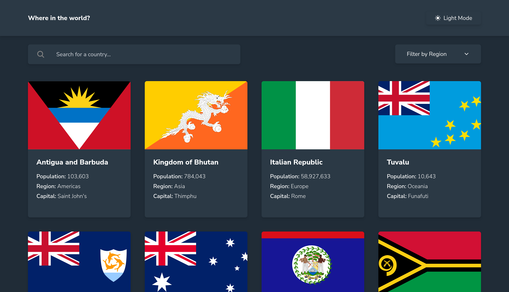

# Frontend Mentor - REST Countries API with color theme switcher solution

This is a solution to the [REST Countries API with color theme switcher challenge on Frontend Mentor](https://www.frontendmentor.io/challenges/rest-countries-api-with-color-theme-switcher-5cacc469fec04111f7b848ca). Frontend Mentor challenges help you improve your coding skills by building realistic projects.

## Table of contents

- [Frontend Mentor - REST Countries API with color theme switcher solution](#frontend-mentor---rest-countries-api-with-color-theme-switcher-solution)
  - [Table of contents](#table-of-contents)
  - [Overview](#overview)
    - [The challenge](#the-challenge)
    - [Screenshot](#screenshot)
    - [Links](#links)
  - [My process](#my-process)
    - [Built with](#built-with)
    - [What I learned](#what-i-learned)
    - [Continued development](#continued-development)
    - [Useful resources](#useful-resources)

## Overview

### The challenge

Users should be able to:

- See all countries from the API on the homepage
- Search for a country using an `input` field
- Filter countries by region
- Click on a country to see more detailed information on a separate page
- Click through to the border countries on the detail page
- Toggle the color scheme between light and dark mode _(optional)_

### Screenshot

### Links

- Solution URL: [Add solution URL here](https://your-solution-url.com)
- Live Site URL: [Add live site URL here](https://your-live-site-url.com)

## My process

### Built with

- Semantic HTML5 markup
- CSS custom properties
- Flexbox
- CSS Grid
- Mobile-first workflow
- [React Router](https://reactrouter.com/) - For Routing
- [React](https://reactjs.org/) - JS library
- [Tailwind CSS](https://tailwindcss.com/) - For Styles
- [Vite](https://vite.dev/) - Build Tool
- [Ionicons](https://ionic.io/ionicons) - For Icons

### What I learned

- Learned the difference between building an SPA and SSR app.
- Learned how to create multi-page applications and implement routing in them.
- Learned how to handle, fetch, load and cache slow APIs through this project since REST countries API is very slow.
- Learned how to have fallback UI's for component failing to render on failed requests.
- Learned how data is used to fetch other data on another page.
- How to use Ionicons.

### Continued development

- Probably be using Next.js to create this project fast.
- Use a popular UI library here (shadcn).

### Useful resources

- [React Router Tutorial](https://reactrouter.com/tutorials/address-book) - This tutorial teaches how a simple application can be made using react router.
